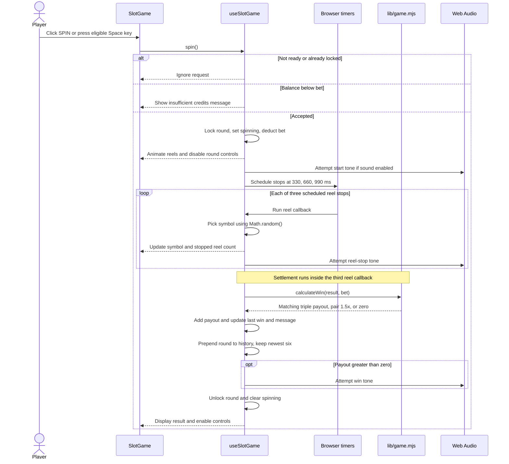

# Velvet Reels sequence diagrams

These diagrams describe the current Next.js app, not the legacy prototype in `dist/`. Game state, random outcomes, and payouts run in the browser; there is no game API or database. Mermaid-compatible Markdown viewers render the diagrams below.

## 1. Startup and balance persistence

Sources: `app/page.js`, `components/slot-game.js`, `components/use-slot-game.js`, `lib/game.mjs`.

```mermaid
sequenceDiagram
    participant UI as SlotGame
    participant Hook as useSlotGame
    participant Rules as lib/game.mjs
    participant Storage as localStorage
    UI->>Hook: Initialize shared game state
    Hook-->>UI: Balance 10000 VC, bet 100 VC, ready false
    Note over Hook,Storage: On browser mount
    Hook->>Storage: getItem("vr-balance")
    alt Storage readable
        Storage-->>Hook: Saved string or null
        Hook->>Rules: restoreBalance(value)
        Rules-->>Hook: Nonnegative safe integer, otherwise 10000
        Hook->>Hook: Set restored balance
    else Storage throws
        Hook->>Hook: Keep initial balance
    end
    Hook->>Hook: Set ready true
    Hook-->>UI: Enable play and reset controls
    loop Ready becomes true or balance changes
        Hook->>Storage: setItem("vr-balance", String(balance))
        Note over Hook,Storage: Write failures are ignored; in-memory play continues
    end
```

Only the balance persists. Bet, recent rounds, selected game, and sound preference start fresh on reload. A saved zero balance is valid. Persistence occurs through a React effect after state updates, independently of the round sequences below.

## 2. Slot spin

Sources: `components/slot-game.js`, `components/use-slot-game.js`, `lib/game.mjs`.



Space works only in Slots, ignores repeated key events, and does not trigger from inputs, buttons, textareas, selects, links, or editable content. Missing or failing audio does not interrupt play. Timer delays are scheduled delays, not guaranteed execution times.

## 3. Dice, Roulette, and Plinko

Sources: `components/casino-game.js`, `components/use-slot-game.js`, `lib/casino.mjs`.

```mermaid
sequenceDiagram
    actor Player
    participant Game as CasinoGame
    participant Hook as useSlotGame
    participant Timer as Browser timer
    participant Rules as lib/casino.mjs
    Player->>Game: Play selected game
    alt Local roundLock is set
        Game->>Game: Ignore request
    else Local roundLock is clear
        Game->>Hook: startRound()
        alt Not ready, shared lock set, or insufficient credits
            Hook-->>Game: false (show message if insufficient credits)
        else Accepted
            Hook->>Hook: Set shared lock and spinning, deduct bet
            Hook-->>Game: true
            Game->>Game: Set local lock and clear prior result
            opt Plinko
                Game->>Game: Generate eight random left/right steps
                Game->>Game: Store path for ball animation
            end
            Game->>Timer: Schedule result (750 ms, or 1500 ms for Plinko)
            Timer->>Game: Run result callback
            alt Dice
                Game->>Game: Draw integer 0-99 and display roll
                Game->>Game: If roll below threshold, multiplier = floor(97 / threshold * 100) / 100; else zero
            else Roulette
                Game->>Game: Draw integer 0-36 and display number
                Game->>Rules: rouletteColor(number)
                Rules-->>Game: Red, black, or green
                Game->>Game: Matching color pays 2x, green 36x; mismatch zero
            else Plinko
                Game->>Rules: Read PLINKO[path[7]]
                Rules-->>Game: Landing-bin multiplier
                Game->>Game: Mark ball landed
            end
            Game->>Hook: finishRound(title, result, multiplier)
            Hook->>Hook: If shared lock set, add floor(bet * multiplier)
            Hook->>Hook: Update payout, message, and newest six rounds
            Hook->>Hook: Clear shared lock and spinning
            Game->>Game: Clear local lock
        end
    end
```

Multipliers return the total payout including the stake; the bet was already deducted on entry. Plinko bins, left to right, pay `10, 3, 1.5, 0.5, 0.2, 0.5, 1.5, 3, 10` times the bet.

## 4. Mines: reveal, lose, or collect

Sources: `components/casino-game.js`, `components/use-slot-game.js`, `lib/casino.mjs`.

```mermaid
sequenceDiagram
    actor Player
    participant Game as CasinoGame (Mines)
    participant Hook as useSlotGame
    participant Rules as lib/casino.mjs
    Player->>Game: START ROUND
    Note over Game,Hook: Local lock must be clear; startRound applies shared entry guards
    Game->>Hook: startRound()
    alt Entry rejected
        Hook-->>Game: false
    else Entry accepted
        Hook->>Hook: Lock shared round, set spinning, deduct bet
        Hook-->>Game: true
        Game->>Game: Set local round lock
        Game->>Rules: drawMines()
        Rules-->>Game: Three unique mine positions among 25 cells
        Game->>Game: Clear revealed tiles and set state playing
        loop Reveal tiles while playing
            Player->>Game: reveal(index)
            alt Not playing, not locally locked, or tile already revealed
                Game->>Game: Ignore reveal
            else Valid reveal
                Game->>Game: Append tile to revealed ref and state
                alt Mine hit
                    Game->>Game: Set lost and clear local lock
                    Game->>Hook: finishRound("Mines", "Mine hit", 0)
                else All 22 safe tiles revealed
                    Game->>Rules: mineMultiplier(22)
                    Rules-->>Game: Multiplier
                    Game->>Game: Set collected and clear local lock
                    Game->>Hook: finishRound("Mines", "22 gems", multiplier)
                else Safe tile, fewer than 22 revealed
                    Game-->>Player: Show gem and updated collect value
                    Note over Game,Hook: Both locks remain set; balance unchanged
                end
            end
        end
        opt Player collects while playing with at least one revealed tile
            Player->>Game: collect()
            Game->>Game: Check playing, local lock, and revealed count
            Game->>Game: Clear local lock and set collected
            Game->>Rules: mineMultiplier(revealed count)
            Rules-->>Game: Multiplier
            Game->>Hook: finishRound("Mines", gem count, multiplier)
        end
        Note over Game,Hook: Each terminal path calls finishRound once
        Hook->>Hook: On finishRound, add floor(bet * multiplier)
        Hook->>Hook: Update payout, message, and newest six rounds
        Hook->>Hook: Clear shared lock and spinning
        Game-->>Player: Reveal entire board after loss or collection
    end
```

The multiplier is `floor(0.97 / chance * 100) / 100`, where `chance` is the probability of revealing that many safe tiles without replacement. Collection before the first reveal is disabled and also rejected by the handler.

## Shared controls and lifecycle

- While `spinning` is true, game selection, bet changes, and reset buttons are disabled. The hook also guards bet changes and reset using its synchronous lock.
- Changing games keeps the shared hook mounted, retaining balance and history. Each non-slot game mounts a keyed `CasinoGame` with fresh local settings.
- Reset restores 10,000 VC and clears the last payout and win state; it does not clear history or change the bet.
- On unmount, the hook clears slot timers and closes its audio context; `CasinoGame` clears its own result timer. There is no separate refund or interrupted-round recovery flow.
